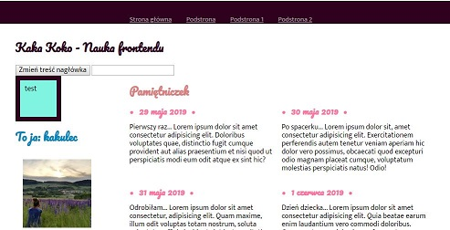

# Moja strona główna (pierwsza)
Zapraszam: [Strona domowa do kursu WTF](https://github.com/kakuliniec/homepage-gulp)

## Jak uruchomić moją stronę lokalnie
Chcesz wejść? Wykonaj poniższe polecenia:

`npm install -g gulp-cli`

`npm install`

`gulp`

To publish your page using github pages use `npm run deploy`
